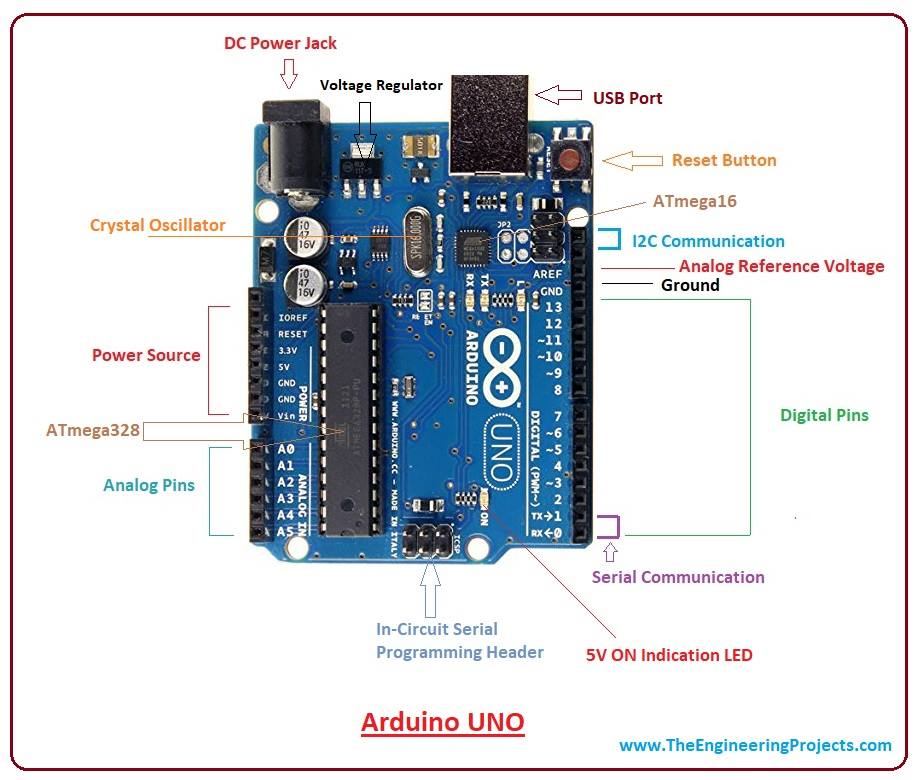

# Microcontrollers

Microcontrollers are the central processor which coordinates the various sensors and motors in the micromouse. They allow one to very easily create programmable logic to voltage readings from sensor values which can become output voltages to other devices such as motors or audio equipment.

Right now the micromouse uses the STM32 and Teensy 4.0 set of microcontrollers.
Below are quick summary of the microcontrollers one can expect to run into when working with SRC.

## Arduino UNO Board

The Arduino Uno is one of the most widely used starter boards in embedded systems programming. It comes with various digital and PWM pins and makes it easy for anyone to upload Arduino code onto it using the Arduino IDE.

## STM32 Board

The STM32 board is a more powerful microcontroller than the Arduino Uno and carries much more memory space.

## Teensy 4.0 Board

and Here is the pin-out for the Teensy

Below are the specifications for the two microcontrollers
(GP stands for General Purpose)
(GPIO stands for General Purpose Input/Output)

| Specification         | STM32F1                       | Teensy 4.0  |
| -------------         |:-------------:                | :-----:|
| CPU Type              | Arm 32-bit Cortex  M3- CPU    |ARM Cortex-M7|
| CPU Frequency         | 72 MHz                        |48 Mhz  up to 600 MHz|
| Output Voltage        | 2.0 to 3.6 V                  |3.3 Volts |
| Input Voltage         | 3 to 5 V (or usb)             |3 to 3.6 V (or usb)|
| Current Consumption   | uhhh                          |100 mA @ 600 MHz|
| Flash Memory          |  64 KB                        |2048 KB |
| RAM                   |  20 KB                        |    1024 KB |
| Timers                | 4 Timers                      |    2 GP timers (32 bit) |
| Analog to Digital     | 12 bit ADC (2)                |    12 bit ADC (2) |
| GPIO                  | 32                            |40 |
| PWM                   | 20                            | 31 |
| Interrupts            | Yes                           |Yes, all pins|
| I2C                   | 2 Modules                     |    4 Modules |
| SPI                   | 2 Modules                     |    4 Modules |
| UART                  | 3 Channels                    | $1 |
| Buy LINK              | [link]()                      |    [link](https://www.sparkfun.com/products/15583) |
| Spec Sheet            | [link](https://www.st.com/resource/en/datasheet/stm32f103c8.pdf)               |   [link](https://cdn.sparkfun.com/assets/3/5/3/7/3/IMXRT1060CEC_rev0_1.pdf) |