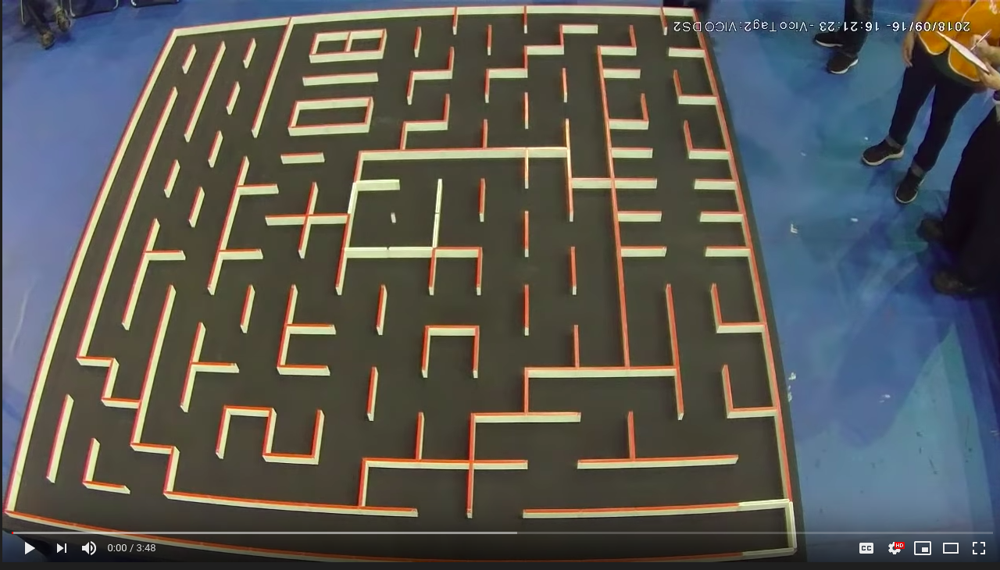

# The micromouse project

One of the main projects of SRC is to build a micromouse robot. 
The purpose of this robot is to solve a physical maze using an autonomous wheeled robot. 

## Video link of a micromouse robot in action 

## Rules
The rules of the micromouse vary from region to region but the following usually hold.

1) The maze consist of square cells of width 16.8 cm
2) The mouse is alloted a time slot to traverse to the goal as fast as possible
3) The mouse begins a "run" when it starts moving from the start. The run ends once the mouse reaches the center.
4) The team is judged on the fastest run. Sometimes fastest first run (mapping run)
5) The mouse is 

## Challenges
 
The micromouse robot introduces a set of challenges involving the integration of sotware models with real world limitations.

* Finding out where the mouse is in the maze
* Making sure the mouse drives in a reliable way
* Mapping the maze as the mouse traverses it
* Finding the shortest path to the goal of the maze

## Resources

Two websites form as great resources for the micromouse

[Green ye's blog](http://greenye.net/)

[And his micromouse USA website](http://micromouseusa.com/)

Green's blog has a good set of parts checklist and pictures that are useful for design and the micrmouse USA website goes into depth on many common challenges one has to overcome when designing a micromouse.
