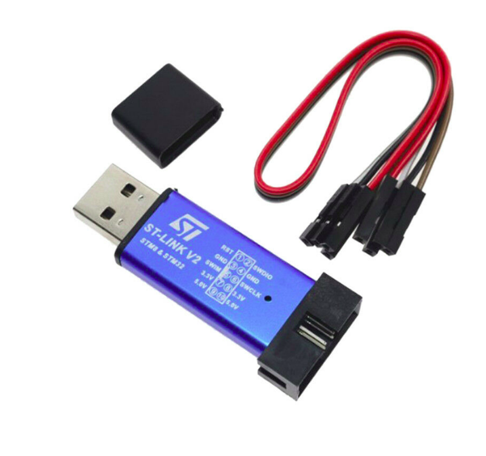

# STM32 / Teensy Setup (STM32f103T / Teensy 4.0)

The teensy 4.0 and STM32 famility microcontrollers do not come with prebuilt Arduino IDE functionality but there are third party libraries that allow one to program these controllers using the Arduino IDE.

## Arduino_STM32

There exists an stm32 library for Arduino. One can read the installation instructions from [here](https://github.com/rogerclarkmelbourne/Arduino_STM32/wiki/Installation). Follwing the instructions will allow the Arduino IDE to write to the STM32 family boards.

Once you add the library, one can begin uploading Arduino Code to the STM32 family of microcontrollers. There are various ways to do this, from usb, to using external programmers. So far we have only had success using the ST-Link programmer to program the STM32 but tutorials to allow usb programming can be found [here]().

### Using the ST-Link to Upload Arduino Code

The ST link is a usb to serial programmer specficially for the STM32 family of microcontrollers. There is a set of sotware suites for the ST Link which are not necessary to upload code to it but useful for when you accidentally destroy your board.

Once you open the Arduino IDE

* go under tools and hover over to the boards section
* scroll down the boards menu to the "STM32F1 boards" section
* Select the "Generic STM32F103T Series" 
* Back in the tools menu, make sure the "Variant:" tab has the right stm32 (20 kb RAM 64 kb Flash)
* Back in the tools menu hover over the "Upload Method" and select "STLink"

You need to connect the ST-Link to the STM32 as follows:

TODO 

TODO: INCLUDE PICTURES DESCRIBING WHAT PINS TO USE

One can then upload normal Arduino Code to the STM32. One thing to note is that the pin numbers are best shown as the numbers on 
<a href="/book/micromouse/microcontrollers.html#stm32-board"> The reference picture </a> (Note there is not underscore after the reference unlike in the picture so pin PA_7 is actually written as PA7)

## Teensyduino 
